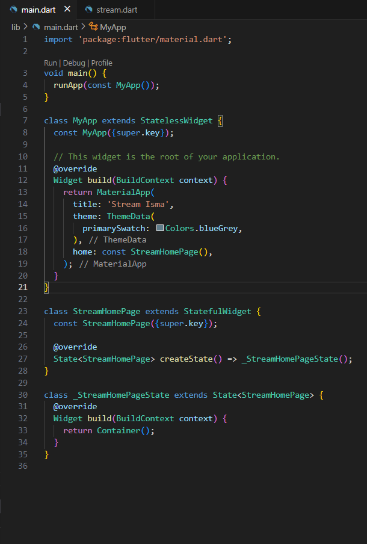
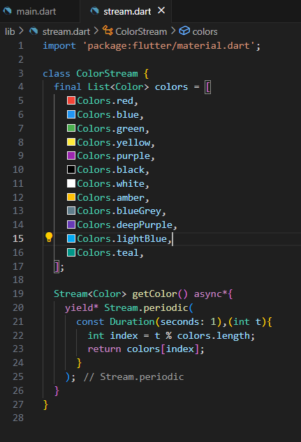
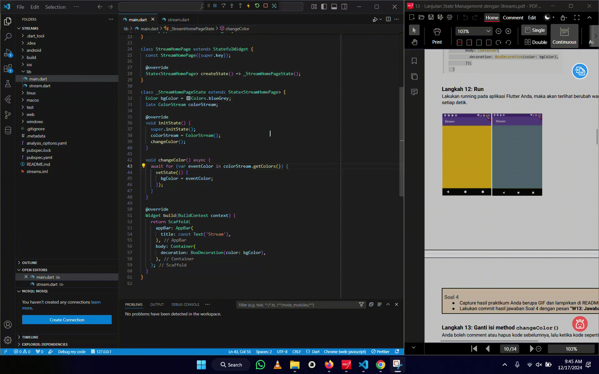

# Praktikum Streams 
=====================
### Lanjutan State Management dengan Streams

# Praktikum 1 :

## Hasil :

# 

# 

- Fungsi *yield* * adalah untuk mendelegasikan kontrol iterasi ke iterable atau stream lain

# 

# Praktikum 2 :
## Hasil :
